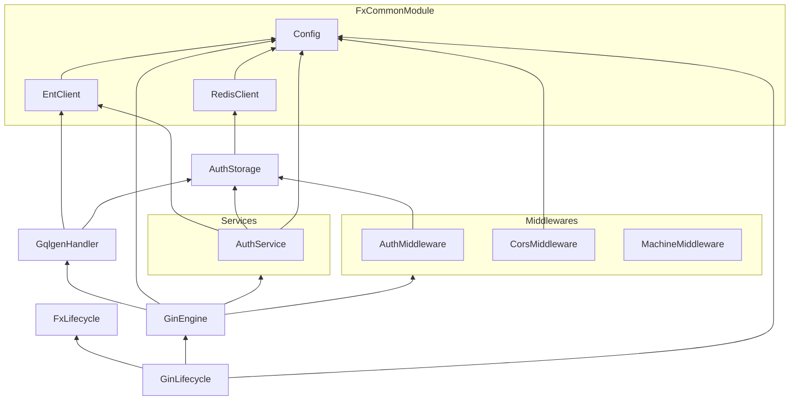

# backend

Backend 是一個使用 [`uber-go/fx`](https://github.com/uber-go/fx) 進行依賴注入的 Gateway、Resource Server 和一部分的 Authorization Server。

## 依賴

如上圖所示，標註（Annotate）為 `services` 的 HTTP 服務，和標註為 `middlewares` 的 Middleware，會在 GinEngine 階段被自動註冊。你只需要確保你需要的服務和 Middleware 有正確標註即可。

以 HTTP API 形式提供呼叫介面的 Services，請定義在 [httpapi](../../httpapi) 目錄當中，並實作其 `Services` 介面。GraphQL 相關則請參考 [graph](../../graph) 目錄。

## API 架構

- `/api/*`：HTTP API，請參見 [httpapi 文件](../../httpapi/README.md)。
- `/query`：GraphQL API，開發手冊請參見 [graph 文件](../../graph/README.md)，使用手冊請參見 GraphQL Playground 的說明。
- `/metrics`：backend server 的 Prometheus 格式 metrics。
- `/`：GraphQL Playground。
