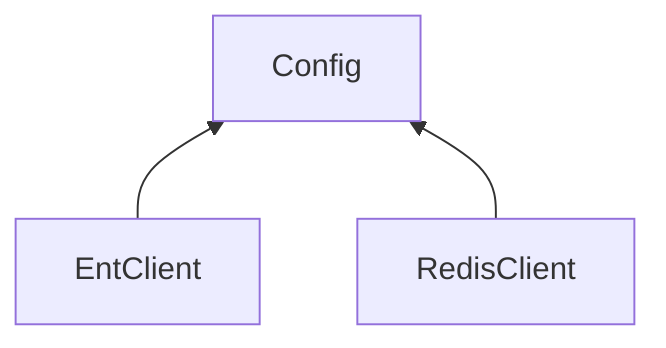

# deps

deps 放置 `backend` 和 `admin-cli` 的共通依賴和物件。

## `FxCommonModule`

FxCommonModule 是幾個後端服務會用到的共同模組，包含設定、資料庫 client、Redis client 和認證儲存區。

依賴鏈如下：

```mermaid
flowchart BT
    Config

    EntClient --> Config
    RedisClient --> Config
```
