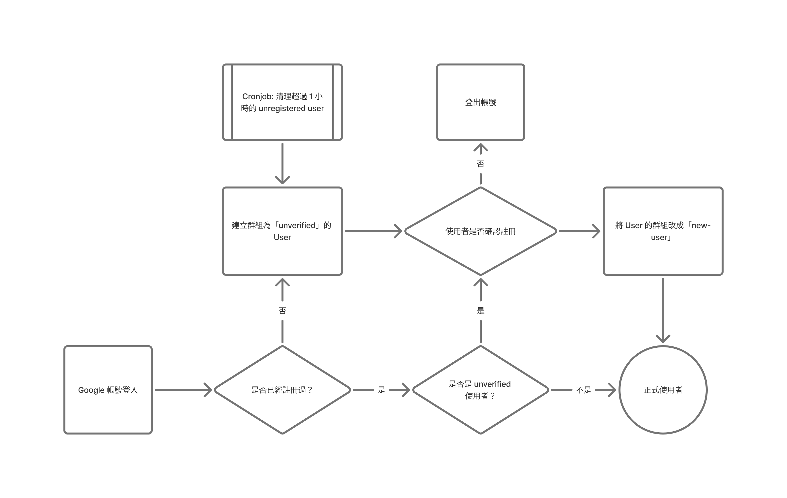

# useraccount

useraccount 套件處理使用者的預定義執行流程。

## 註冊

- 使用者使用 Google 帳號或其他 OAuth 方式登入。
- 確認是否已經有這個使用者，如果沒有，建立一個 `unverified` 群組的使用者。
- `unverified` 群組授予 `verification:write` scope，引導使用者執行驗證。
- 使用者驗證完成後，授予 `new-user` 群組。
- 如果使用者放棄驗證，則直接走登出流程。
- Cronjob 會在每個小時定期清除 unverified users。
